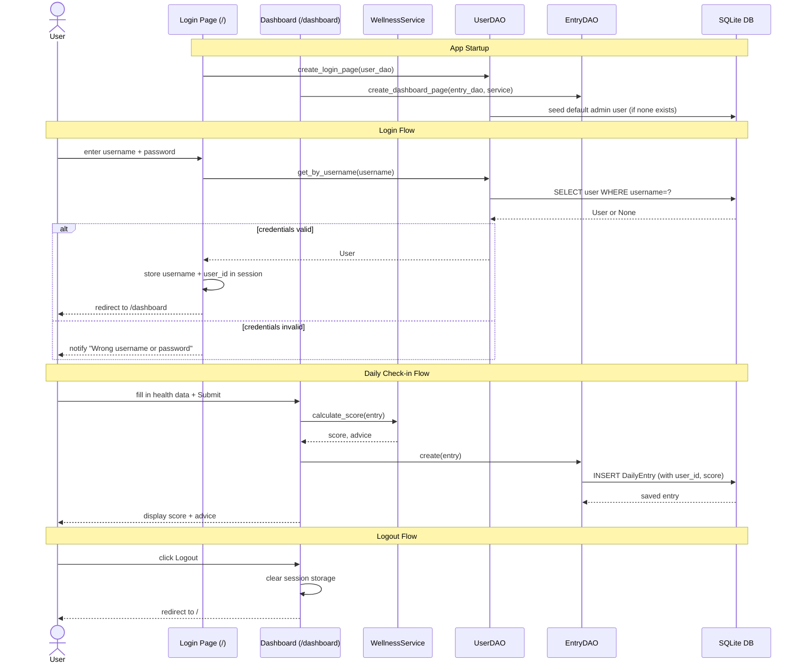

# E-LIF-E 2.0 — Daily Wellness Tracker

A browser-based daily wellness tracker built with NiceGUI. Users log health data each day, receive a calculated wellness score (0–75), and get personalised advice.

---

## Python Version

**Python 3.11.x is required.** SQLModel has a known incompatibility with Python 3.12+.

To check:
```bash
python --version
```

---

## Installation

```bash
pip install -r requirements.txt
```

---

## Running the App

```bash
python main.py
```

Opens at [http://localhost:8080](http://localhost:8080).

Default login: `admin` / `1234`

---

## Running Tests

```bash
# All tests
pytest

# Specific test file
pytest -v elife_app/tests/test_unit.py
pytest -v elife_app/tests/test_db.py
pytest -v elife_app/tests/test_integration.py
```

---

## Architecture

The app uses a layered MVC structure. `ElifeApplication` (`elife_app/application.py`) is the composition root — it wires together the database, DAOs, services, and NiceGUI routes at startup.

**Layer flow:** UI pages → DAO (data access) → Database (SQLite)

### Application Flow



### Key Files

| File | Role |
|---|---|
| `main.py` | Entry point — creates `ElifeApplication` and calls `run()` |
| `elife_app/application.py` | Composition root; wires all dependencies and registers NiceGUI routes |
| `elife_app/domain/models.py` | SQLModel ORM models: `User`, `DailyEntry` |
| `elife_app/data_access/db.py` | `Database` class: engine creation, schema init, session scope |
| `elife_app/data_access/dao.py` | `EntryDAO`, `UserDAO` — data access layer |
| `elife_app/data_access/seed.py` | `WellnessSeeder` — seeds sample data |
| `elife_app/logging_config.py` | Configures terminal and file logging |
| `elife_app/services/wellness_service.py` | Score calculation and weekly report logic |
| `elife_app/ui/Login.py` | NiceGUI login page (route `/`) |
| `elife_app/ui/Dashboard.py` | NiceGUI daily check-in page (route `/dashboard`) |

### Wellness Score

The score is calculated from:

| Factor | Points |
|---|---|
| Sleep quality | 0–10 |
| Mood | 0–10 |
| Friends (saw friends today) | 0 or 10 |
| Exercise | 0 or 10 |
| Hobbies | 0 or 10 |
| Medication taken | 0 or 10 |
| Steps (1 pt per 5,000, max 10) | 0–10 |
| Water intake (1 pt per litre, max 5) | 0–5 |
| Stress level (deducted) | −0 to −10 |
| Excess work hours over 8 (deducted) | −0 to −8 |

**Maximum score: 75**

---

## Logging

The app logs to both the terminal and `logs/elife.log` using Python's built-in `logging` module.

**Format:**
```
2026-05-10 19:45:01 | DEBUG    | application.py:24 | __init__ | ElifeApplication initialising
2026-05-10 19:45:05 | DEBUG    | Login.py:23       | login    | Login attempt for username: admin
2026-05-10 19:45:05 | WARNING  | Login.py:31       | login    | Failed login attempt for username: wronguser
2026-05-10 19:45:12 | DEBUG    | Dashboard.py:78   | submit   | Check-in submitted — user_id: 1, date: 2026-05-10, score: 47
```

**What is logged:**

| Layer | Events |
|---|---|
| App startup | Init, schema, seeding, routes, server start |
| Login | Every attempt, success (DEBUG), failure (WARNING) |
| Dashboard | Check-in submit with score, logout |
| DAO | Every DB read/write with relevant IDs |

The `logs/` directory is created automatically and is excluded from git.

---

## Database

- Default: `sqlite:///data/elife.db` (created automatically on first run)
- Override via `DATABASE_URL` environment variable
- Tests use `sqlite:///:memory:`

> If you have an existing `data/elife.db` from before the refactor, delete it before running — SQLite does not auto-add columns to existing tables.

---

## Changes from Phase 1

A summary of what was fixed and improved in this version:

| # | What | Why |
|---|---|---|
| 1 | Deleted old CLI (`elife_app/main.py`, `01 Previous Project/`) | Dead code with broken imports, caused confusion about entry point |
| 2 | Score now subtracts stress and excess work hours | Both were collected but ignored — score was misleading |
| 3 | `DailyEntry` linked to `User` via `user_id` | Entries had no owner; weekly report mixed all users together |
| 4 | `WellnessSeeder.seed()` now commits | Data was silently discarded without a commit |
| 5 | Login wired to `UserDAO` (was hardcoded `admin`/`1234`) | Only one user could ever log in |
| 6 | Period pain and flow UI fields added to Dashboard | Fields existed in DB but had no UI |
| 7 | Integration tests added | `test_integration.py` existed but was empty |
| 8 | Debug logging added throughout | No visibility into app behaviour during troubleshooting |
